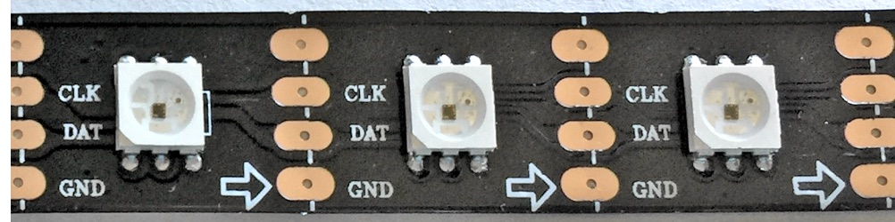
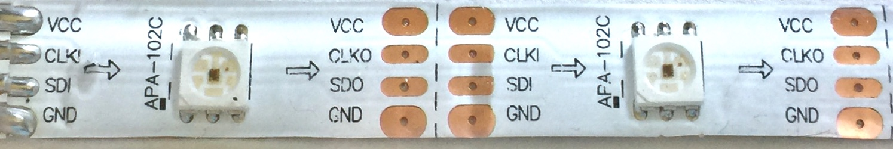
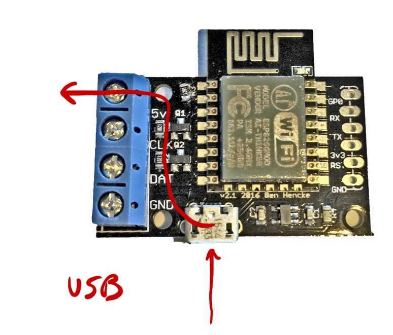
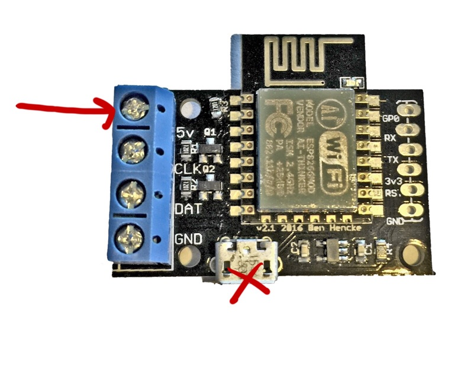
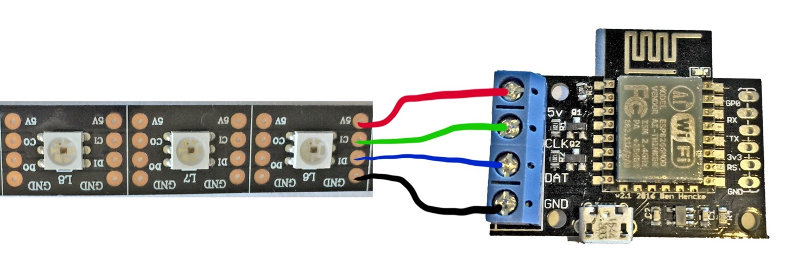
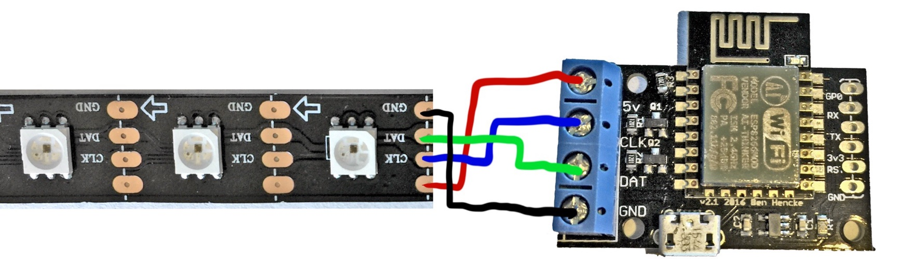
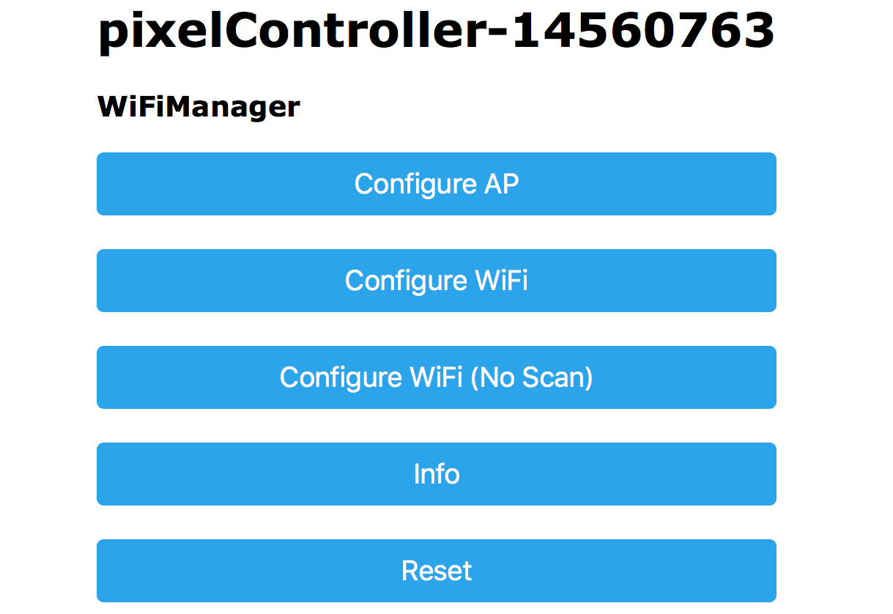
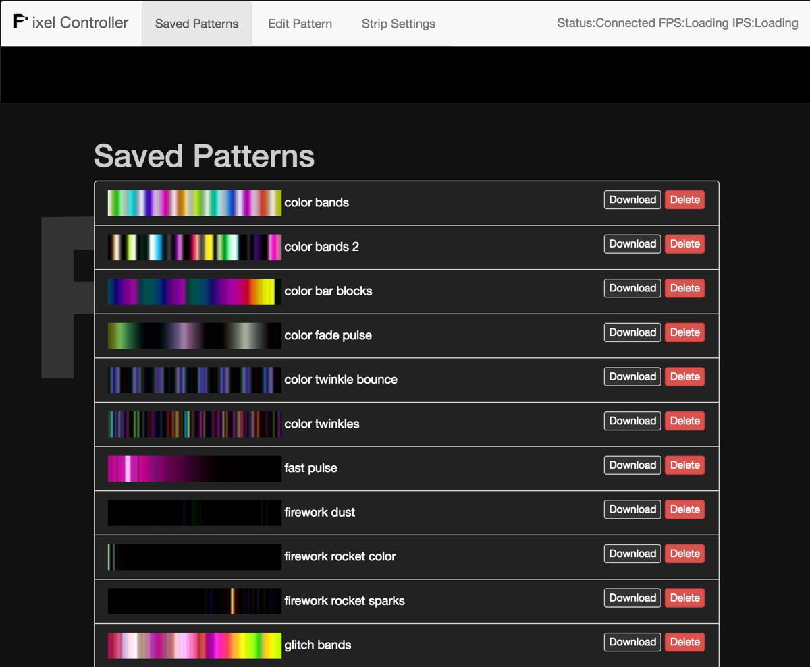
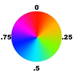
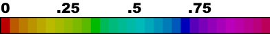

# Getting Started

## Supported LEDs

First you need to make sure you have the right kind of LEDs. 

The controller supports APA102/APA102C and Adafruit's [DotStar](https://www.adafruit.com/category/885) LEDs. The modules usually have 4 input pins or wires: 2 for power, 1 for clock, and one for data. These can come in a wide variety of styles and markings. These have integrated controllers, so you won't see a separate IC controlling the LEDS, it's built in. Here are some pictures of various strips:





Some older LED strips also have 4 input wires/pins, but use a different controller chip, which is usually separate from the LEDs such as the [LPD8806](https://www.adafruit.com/product/306). These are not currently supported. 

The controller doesn't currently work with the popular WS2811, WS2812, PD9823, or Adafuit's NeoPixel LEDs. These typically have 3 input wires/pins, only one of which is for sending data.

## Powering Everything

### Power from USB
The controller and strip can be powered from the micro USB connector. The USB power is connected internally to the 5v screw terminal. With this setup, be aware that there are power limitations to powering via micro USB, and the total current draw should be kept under `1.8A` or the rating for the USB power supply (whichever is lower). Each color of the RGB pixel can draw `20ma`, which can add up quickly. For example, a strip of full-brightness white (R+G+B) with 30 pixels will draw `30 * (20ma + 20ma + 20ma) = 1.8A`, enough to max out the USB connector.



If your power requirements exceed this, the controller can still be powered via USB if the strip has it's own power supply. In this case, leave the 5v screw terminal disconnected.

### Power from the 5v Screw Terminal

If you supply power to the LED strip, often you can backfeed this to the 5v screw terminal and power the controller this way without needing USB power. If you do connect power to the 5v terminal, you shouldn't connect USB power. The controller will draw power from the strip's power supply. This method works best for longer strips of LEDs that require more power than USB can provide.



## Wiring the LEDs

The controller has 4 screw terminals: 5v, CLK, DAT, and GND. The CLK (clock), DAT (data), and GND (-) must always be connected to the strip to function. See the above section to learn the different ways the controller and strip may be powered.

The wire/pin order for many APA102 strips varies, so be careful that you have the right order!

Keep in mind that the strips have connections on both ends, but only one end is an input that can be connected to the controller. Many strips have an arror indicating data flow, if so this should be pointed away from the connection to the controller. Some strips simply indicate this with an 'i' for input and 'o' for output.

Here are some examples:

In the above example, There's no arrow, so we need to use the labeling to figure out which end is the input. The CI indicates "clock in" and is connected to CLK, whereas DI indicates "data in" and is connected to DAT. 


In this example, there is no indicator for 5v, but the other pins are labled. The wiring would be straight across if the pixels were face down, but that wouldn't make for a very interesting picture!

# Setting up WiFi

When the controller is powered on, it will pulse LEDs on the strip to indicate startup status. When it first powers on, it will try to connect to the last network and will pulse blue during this time. If it cannot connect, it will enter setup mode and pulse yellow/orange.

## Setup Mode
In setup mode, the controller creates a new WiFi network that starts with "pixelController-" and has a random number.

Connect to this network from a computer or mobile device, then a WiFi Manager screen should pop up on your computer or device. If it does not, open a browser and go to [http://192.168.4.1](http://192.168.4.1)



Here you can configure the controller to run in either AP (Access Point) mode, where it will create a wifi network, or as a regular client to an existing network.

### WiFi Client Mode

Clicking on "Configure WiFi" will scan for networks and bring up a screen similar to this:


Once the controller has connected to wifi, it will have an IP address on your network. [These instructions for finding a raspberry pi](https://www.raspberrypi.org/documentation/remote-access/ip-address.md) without a display provide a good outline of ways to find a device on your network. If you use the nmap method e.g. `nmap -sn 192.168.1.0/24`, the controller hostname will likely start with "ESP_" followed by some hexadecimal.

### AP Mode

You can also set up the module to run in AP mode, if so, connect to the WiFi network you configured, then browser to the controller's IP:
[http://192.168.4.1](http://192.168.4.1)

# Using the Web Interface

Once you know the IP address of your controller, you can point a browser to it. You should see a screen that looks like this:



There are 3 tabs across the top: Saved Patterns, Edit Pattern, and Strip Settings.

## Saved Patterns
Here you can preview and select any pattern that has been previously saved to the controller. Your controller should have come with a few patterns to get you started.

You can download a pattern file for sharing by clicking `Download`, and remove patterns you no longer want with `Delete`.

Clicking anywhere else on the line will load the pattern in the `Edit Pattern` tab, and select that pattern for display.

## Edit Pattern
Here you can create new patterns, edit existing patterns, or load pattern files.

A pattern is a mathematical expression to generate pixels. 

### Creating a New Pattern
Click the `New Expression` button. 

You can now type expressions into the global and pixel expression text areas. Everything you type is compiled on the fly and sent to the controller. An online reference is provided on the page below.

You may want to jump to [Writing Your First Pattern](#writing-your-first-pattern)

You can save a pattern by providing a unique name and clicking `Save` once a preview has been generated. After each edit, a preview is generated. This takes a few seconds.

If you are editing an existing pattern, `Save` will become an `Update` button.

## Strip Settings
Here you can change settings related to the LED strip.

The Pixels setting controlls how many pixels will be generated. Since these are calculated as they are sent out, arbitrarily large strips can be supported with modest frame rates.

The Color Order can be used to correct color issues with different versions of LEDs. 

The Data Speed controls how fast data is sent out to the strip. Faster speeds may improve frame rates, but if you experience flickering, try a lower Data Speed.

The HSV Mode switches between 3 different HSV (hue saturation and value) functions. 

* HDR Spectrum is an advanced HSV implementation that is designed to compliment the extended brightness range of the APA102/DotStar LEDs, and has a much higher dynamic range (HDR) than most LED controllers.
* Spectrum is a standard HSV implementation, limited to 255 brightness levels per color.
* Rainbow uses the [FastLED HSV implementation](https://github.com/FastLED/FastLED/wiki/FastLED-HSV-Colors) that provides a more natural spectrum that can be more pleasing to the human eye and brings out richer yellows. 

#Writing Your First Pattern

Lets start by creating a very simple rainbow. Enter this expression in the Pixel Expression text area:

```
hsv(i/l, 1, .5)
```

What this is doing is using the HSV (hue saturation and value) system to create a color. This expression is evaluated for each pixel. The hue of the color is the first argument, and we've given it an expression that includes 2 special variables `i` and `l`. `i` is a number that indicates which pixel in the strip is being evaluated starting with 0 and going up to the number of pixels in the strip, which is represented by the `l` variable. In this way, the expression `i/l` gives us a range of numbers between 0 and 1 that corresponds with the pixel's position. This works well when mapped to the hue color wheel:




The second argument is the saturation, or how colorful the pixel should be. A value of 1 is a very vivid color, where 0 is grayscale.

The third argument is the color's value, or brightness. A value of 1 is as bright as it gets, where 0 is always black, no matter what the other arguments are. A value of `.5` can still be pretty bright in many environments. 

The controller provides an advanced HSV implementation that is designed to compliment the extended brightness range of the APA102/DotStar LEDs, and has a much higher dynamic range (HDR) than most LED controllers.

Give it a try! Set the brightness to `.005` - you should still be able to see a smoothly transitioned rainbow, but with a brightness level than can be used subtly in a dark room without being blinded.

A static rainbow is neat, but a pattern that moves or evolves over time is better! To do that, we'll need to modify some of our hsv arguments with a `time()` component. Enter this in the Pixel Expression text area:

```
h = i/l + time(.1)
hsv(h, 1, .5)
```
You should see something like this on both the LED strip and in the preview area:


You probably noticed that I snuck a variable in the expression. In addition to using the built in variables like `i` and `l`, you can define your own to make expressions easier to read or to speed up frame rates by calculating repeated expressions once.

The `time()` function deserves a bit of an explaination. It returns a value between 0 and 1 that loops over and over. The speed that it loops is inverse to the argument given. A value of `1` will loop about every 65 seconds, where a value of `.1` will loop about every 6.5 seconds. When added to a hue, this basically rotates the color around the hue color wheel. Since we add that to each pixel's fixed hue offset with `i/l`, they all rotate at the same speed relative to each other.

