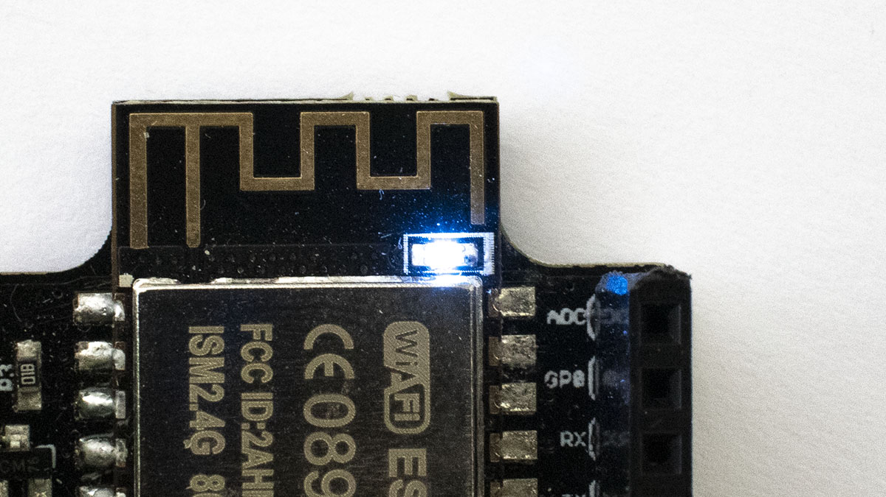
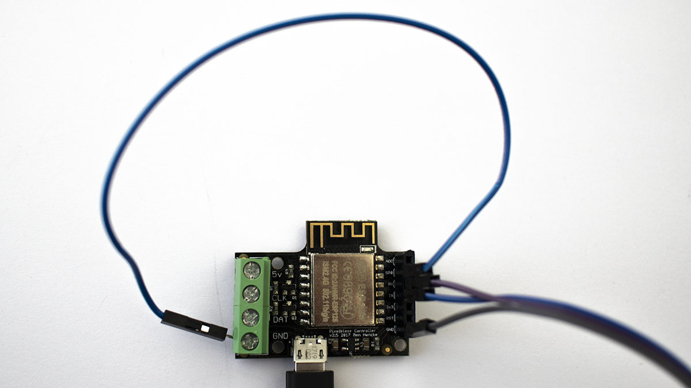

# Table of Contents

A Pixelblaze is designed to be easy to setup and use, but sometimes things
don't go quite as expected. Here are some troubleshooting steps.

1. [Power Supply](#toc_1)
2. [Runtime Logging](#toc_2)
3. [Bootloader](#toc_3)

# Power Supply

The first thing to check is making sure a Pixelblaze has power. A small blue
LED should be illuminated or blinking when power is present.



To see if it might be a power quality issue, connect a Pixelblaze directly
to a computer's USB port _by itself_ : No LED strip, no expansion board, and no
USB hub between computer and Pixelblaze.

If a volt meter is available, use it to verify 3.3 volts are correctly
delivered to the ESP module.


# Runtime Logging

If power supply is good, let's look into whether the Pixelblaze is up and
running like it should be. Connect a 3.3V serial adapter to the serial
communication pins on its expansion header, open up a terminal program on
your computer (115200 8N1) and watch for log entries.


You should see logging data similar to the following:

```
used bytes 499741
Config loaded
No pixelmap
switching to apa102
*WM: Adding parameter
*WM:
*WM: Adding parameter
*WM: discovery
*WM:
*WM: AutoConnect
*WM: Connecting as wifi client...
*WM: Using last saved values, should be faster
*WM: Waiting for connection result with time out
*WM: Connection timed out
*WM: Connection result:
*WM: 1
*WM: SET AP STA
*WM:
*WM: Configuring access point...
*WM: Pixelblaze_0BF309
*WM: AP IP address:
*WM: 192.168.4.1
*WM: HTTP server started
```

Look for log messages relating to WiFi errors and go from there.

# Bootloader

If the Pixelblaze does not output any logging information, check for
bootloader corruption.

Install [esptool](https://github.com/espressif/esptool)

Put a Pixelblaze into bootloader mode. There are several ways to do this,
the easiest is to hold GP0 low upon power-up.



Send a simple query (example below asked for `flash_id`) to see if the
bootloader responds.

```
$ esptool.py --port /dev/ttyUSB0 -b 115200 flash_id
esptool.py v2.6
Serial port /dev/ttyUSB0
Connecting....
Detecting chip type... ESP8266
Chip is ESP8266EX
Features: WiFi
MAC: ec:fa:bc:0b:f3:09
Uploading stub...
Running stub...
Stub running...
Manufacturer: ef
Device: 4016
Detected flash size: 4MB
Hard resetting via RTS pin...

```

If there is no response, proceed to [esptool troubleshooting](https://github.com/espressif/esptool#troubleshooting)