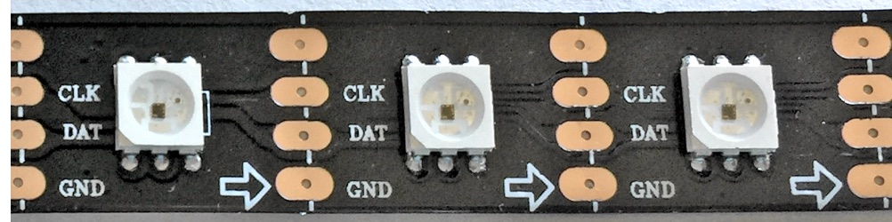
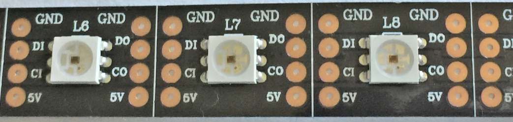
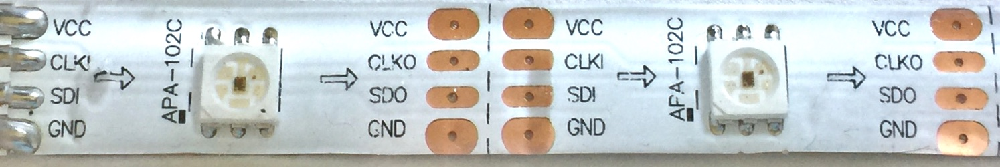
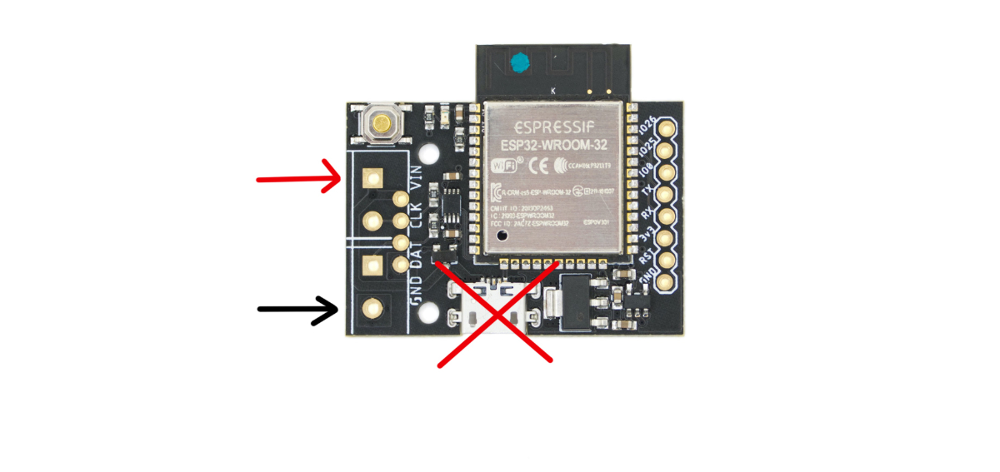
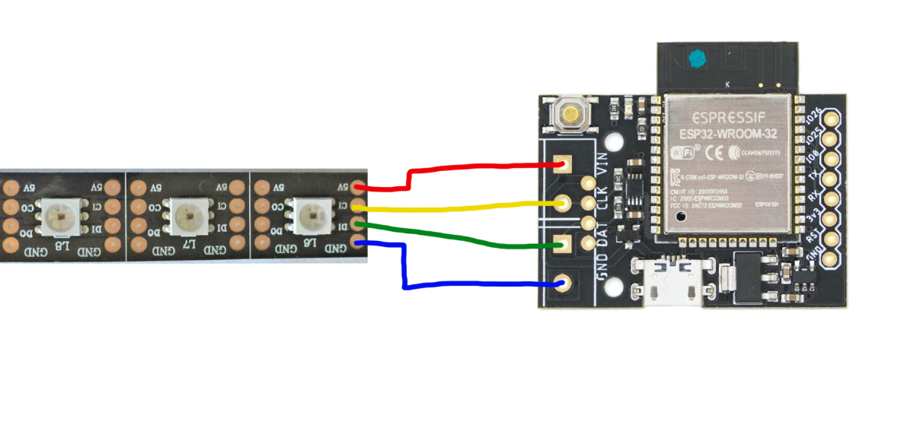
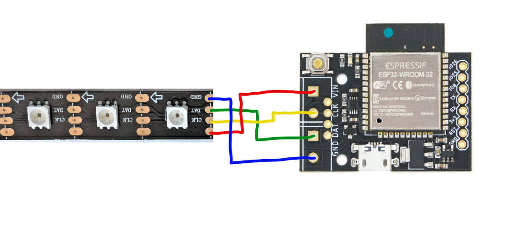
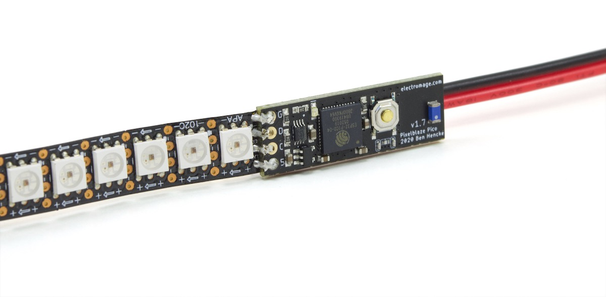

# Getting Started

## Supported LEDs

First you need to make sure you have the right kind of LEDs.

The controller supports the fast, high dynamic range APA102/SK9822 (AKA Adafruit's DotStar) LEDs, as well as WS2801, and WS2811/WS2812/WS2813/WS2815 (AKA NeoPixel) LEDs .

### APA102 Type LEDs

The APA102/SK9822 LEDs are recommended. The modules usually have 4 input pins or wires: 2 for power, 1 for clock, and one for data. These can come in a wide variety of styles and markings. These have integrated controllers, so you won't see a separate IC controlling the LEDS, it's built in. Here are some pictures of various strips:

### WS2812 Type LEDs

WS2812 (AKA Adafruit's NeoPixel) and compatible LEDs like the WS2811, WS2813, WS2815, and SK6812 are also supported. Some of these require 12V, and in these setups will require separate 5V power for Pixelblaze either via the VIN/GND pins or USB.  Never connect 12V to the Pixelblaze's VIN pin.

RGBW variants are also supported with a white element.

### WS2801 Type LEDs

WS2801 LEDs are also supported. These use a 4 wire system with 2 for power, 1 for clock, and one for data. These are commonly packaged in LED strings.

### Unsupported LED Types

Unless an LED is listed as compatible with one of the above variants, it may be unsupported by Pixelblaze. If you are unsure about what LED chipset you have, post a photo to the [forum](https://forum.electromage.com/) and we'll try to help identify it!

## Powering Pixelblaze and LEDs

Each color/element of the pixel can draw current in combination with the others, which can add up quickly. A safe figure to use for power design is 20mA per element per pixel, or 60mA for all white (R+G+B).

Some LEDs draw less. Variants that draw ~12mA per channel (36mA for all 3) are common. There are low power variants that draw up to 5mA per channel. Some 12V LEDs like the WS2815 connect each element in series such that multiple output elements do not increase current consumption.

When in doubt, figure on 20mA per channel or 60mA for full-white per pixel.

RGBW pixels can be configured to either use or ignore the white element. In settings, select the color order RGBW or GRBW to use the white element. To skip using the white element, select RGB-W or GRB-W (notice the minus in the name). When configured to use the white element, power draw is reduced. RGBW pixels displaying white will draw 1 element worth of power (W) instead of 3 (R+G+B). 

### Power from USB (V2 / V2+ / V3 Standard)

The controller and strip can be powered from the micro USB connector. The USB power is connected internally to VIN on the screw terminal. With this setup, be aware that there are power limitations to powering via micro USB, and the total current draw should be kept under 1.8A or the rating for the USB power supply (whichever is lower). 

For example, 30 pixels of full-brightness white (R+G+B) with may draw 30 * (20ma + 20ma + 20ma) = 1.8A, enough to max out the USB connector. However, many patterns will not draw this much and brightness can be reduced in settings to limit current draw. It is possible to drive hundreds of LEDs from USB power without exceeding limits.

<strong class="warning">WARNING:</strong> Never connect both USB and external power at the same time!

If your power requirements exceed the USB connector or USB power supply capabilities, the controller can still be powered via USB if the strip has it's own power supply. In this case, leave the VIN signal on the screw terminal disconnected. The GND signal must be connected between the separate power supplies for data to the pixels to work.

### Power via the LED connection Header

If you supply power to the LED strip, often you can backfeed this to the LED connection header and power the controller this way without needing USB power. If you do connect power in this way, you shouldn't connect USB power. The controller will draw power from the strip's power supply. This method works best for larger systems of LEDs that require more power than USB can provide.

<strong class="warning">WARNING:</strong> Never connect both USB and external power at the same time!

If you are using 12V LEDs, a separate 5V supply is needed for Pixelblaze. The GND signal must be connected between the separate power supplies for data to the pixels to work.  The 5V supply can either be provided via the VIN/GND pins or using USB as a power source.

## Connecting the LEDs

### Connecting APA102 Type LEDs (4 wire)

The controller has 4 connections on the LED connection header: VIN/+5V, CLK, DAT, and GND. The CLK (clock), DAT (data), and GND (-) must always be connected to the strip to function. See the above section to learn the different ways the controller and strip may be powered.

The wire/pin order for many APA102 strips varies, so be careful that you have the right order!

Keep in mind that the strips have connections on both ends, but only one end is an input that can be connected to the controller. Many strips have an arrow indicating data flow, if so this should be pointed away from the connection to the controller. Some strips simply indicate this with an 'i' for input and 'o' for output.

Likewise the clock and data signals are often abbreviated as `C` and `D`. `SDI` and `SDO` are also used for the data line.

#### Examples

In the above example there's no arrow, so we need to use the labeling to figure out which end is the input. The CI indicates "clock in" and is connected to CLK, whereas DI indicates "data in" and is connected to DAT.

In this example, there is no indicator for 5v, but the other pins are labeled. The wiring would be straight across if the pixels were face down, but that wouldn't make for a very interesting picture, so all of the connections are reversed.

The Pixeblaze V3 Pico can be soldered directly to many APA102 type LED strips. Power can be provided using the through hole connections, while the strip is soldered using the castellated edges.

### Connecting WS2812 Type LEDs (3 wire)

The controller has 4 connections on the LED connection header: VIN/+5V, CLK, DAT, and GND. The DAT (data), and GND (-) must always be connected to the strip to function. For this type of LED, the CLK signal is not used and should be left unconnected.

See the above section to learn the different ways the controller and strip may be powered.

### Connecting WS2801 Type LEDs (4 wire)

The controller has 4 connections on the LED connection header: VIN/+5V, CLK, DAT, and GND. The CLK (clock), DAT (data), and GND (-) must always be connected to the string to function. See the above section to learn the different ways the controller and strip may be powered.

## General Purpose Input/Output Signals (GPIO)

Pixelblaze has several GPIOs that can be used as digital or analog inputs, or as outputs to drive external circuitry.

All of the GPIO are 3.3v, with the exception of the ADC input on V2/V2+, which has a limit of 1.0V.

