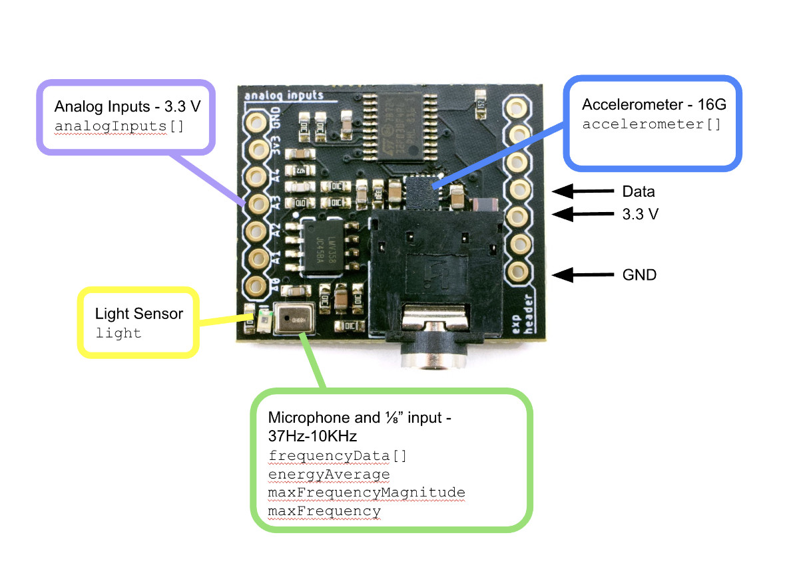

# Sensor Expansion Board

To connect the Sensor Expansion Board, you can use either the pluggable pin headers, solder directly, or run a length of wires. While the expansion port has 7 pins, only 3 are needed for the sensor board: GND, 3v3, and TX.

Once properly connected, the controller will automatically detect the data from the Sensor Expansion Board and will display "Exp: SB1.0" in the status area.

{photo of stacked top headers}

{photo of stacked sandwich}

If you solder directly in a sandwich configuration, make sure there’s some clearance between the board and the shield on the metal shield on the module!

{photo of stacked bottom}

This bottom stack configuation takes little space and the input jack housing helps space the boards apart. The downside of this configuation is that it hides access to many of the GPIO solder pads on the underside of Pixelblaze.
