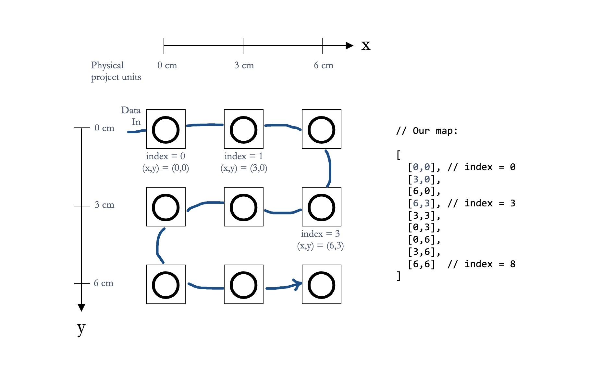
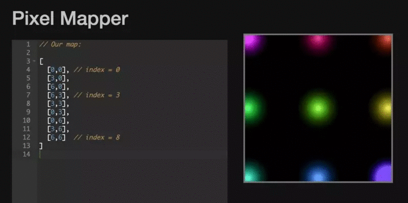
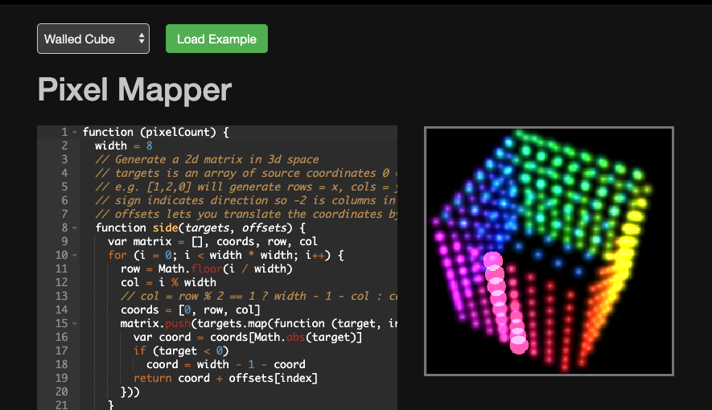
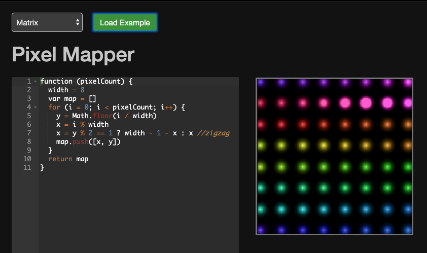
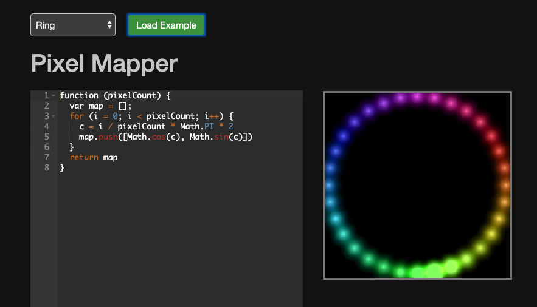
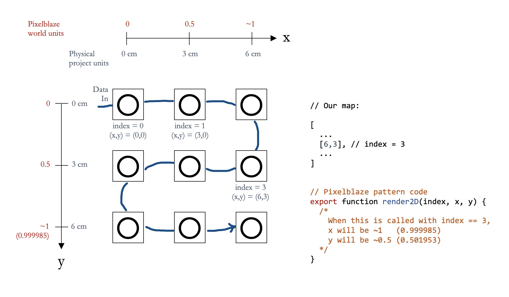
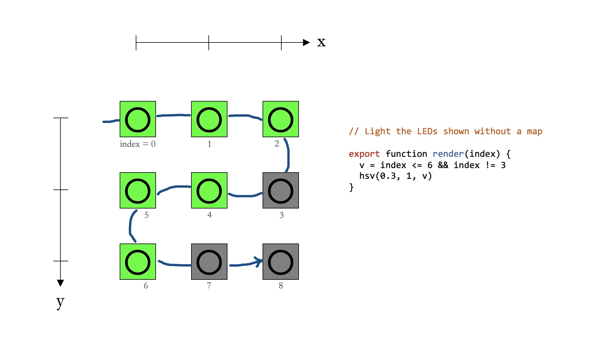
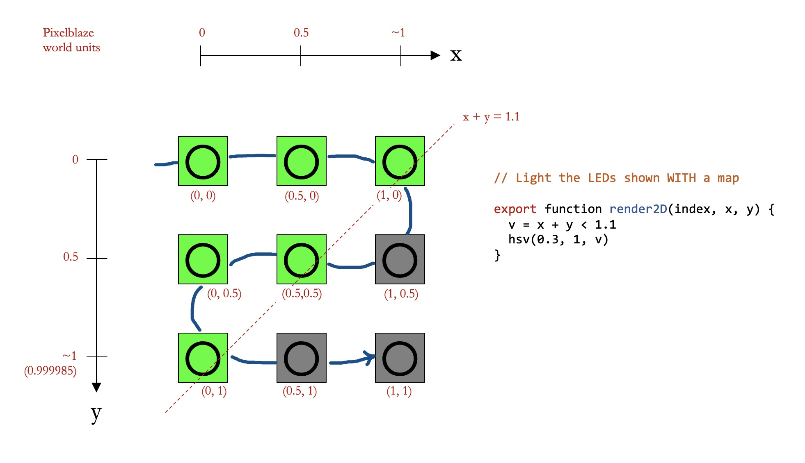
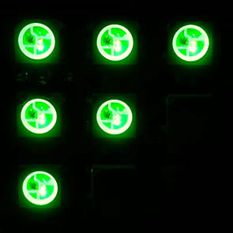
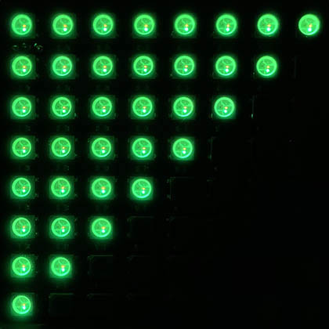

Intro to Mapping in Pixelblaze
===============

If you’re already familiar with the concept of mapping, you may wish to skip to the documentation in the Mapping tab of your Pixelblaze, which can also be [seen on GitHub](https://github.com/simap/pixelblaze/blob/master/README.mapper.md).

The Pixelblaze mapper lets you write pattern code that doesn’t depend on how you wired your project. Instead, you’ll write patterns in terms of space: x, y, and for 3D projects, z.

This lets you use 2D and 3D code that was [written by other people](https://electromage.com/patterns/) without much modification.

To illustrate this, imagine three people who made different 2D displays:

1. An 3” square 8x8 matrix, wired in a zig-zag pattern
2. An 8’ tall curtain of 30 hanging strips, 144 pixels each
3. A strand of individual pixels mounted in holes arranged as triangular grid

Each of these projects could use the same 2D pattern code even though they have a different number of pixels, wiring, size, and arrangement. Each project would only need to define its own map, but could then use the same pattern code. Mapping abstracts the installation from the pattern.

A map assigns each pixel a position in space. The map is a JSON array of x, y, and optionally z coordinates. For example, imagine you had wired up a 3-by-3 matrix consisting of 9 total pixels. If you mounted each pixel 3 cm apart from each other, it’s natural to think of the middle pixel as being located at (3, 3).

Unlike the Cartesian plane in geometry where the y axis is oriented upwards, it’s a convention in computer graphics to think of the top-left as the (0, 0) origin, and y gets bigger in the downward direction.

Did you notice how the mapping array was defined in the project’s physical units of centimeters? This is convenient because you might be able to export an array of coordinates from whatever software you designed your installation in.

When you copy-paste this map into the Mapping tab in Pixelblaze, it generates a 2D or 3D preview for you, and animates a simple pattern through it so you can verify that things look right.

You don’t have to define the map as an array literal like this. You can write some JavaScript to produce the same thing. Pixelblaze’s Mapper comes pre-loaded with several example map generators.



So how could patterns intended for a small square matrix also display on a giant curtain? The answer is that every map has its coordinates auto-scaled to “world units” between 0 and 1. Those scaled values are then passed into the pattern code. Therefore, all 2D/3D patterns are written to expect x, y, and z to be between 0 and 1. In the 9 pixel array example above, the (6, 3) coordinate specified will be scaled to a value very close to (1, 0.5) when provided to the render2D() function. 

To see why this is better, let’s write a pattern that will make a green arrow pointing to the top left. Without a mapper, you might be tempted to do something clever that only works for your 3x3, like this:

Using the mapper, you get to think of your pattern more like a field that flows through your project’s LEDs.

When you define things this way, it’s much easier to adapt any pattern to work on other projects. For example, here’s the exact same pattern (x + y < 1.1) on a 3x3 and an 8x8.

That’s why world units of 0..1 in every dimension are so handy. World units also pair well with all the other built-in helpers like time(), wave(), triangle(), hsv(), and rgb() because everything expects 0..1 arguments and outputs 0..1 too.
