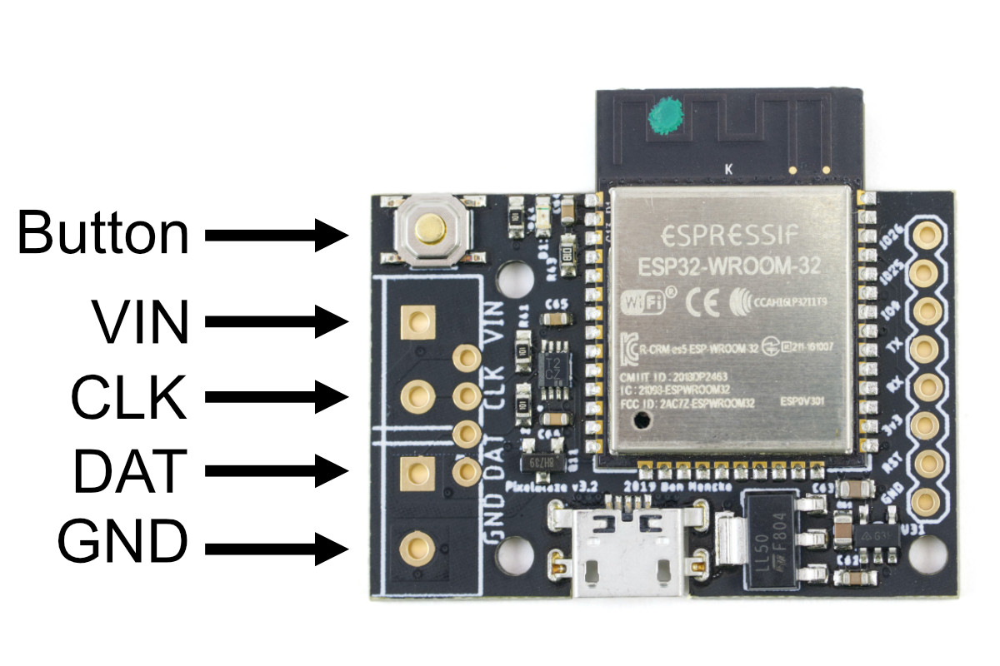

Pixelblaze V3 Standard: Quick Start
===============

Get up and running in 3 easy steps!

1. [WiFi Setup](#step1)
1. [Configure Settings](#step2)
2. [Connect LEDs](#step3)

<style>
.warning {
  color: red;
}

pre {
	color: inherit;
	background-color: #222;
	padding: 1em;
}

img.full {
	width: 100%;
	max-width: 600px;
}
</style>



# <a name="step1"></a>Step 1: WiFi Setup

Connect Pixelblaze to USB power, or provide 5V via the VIN and GND pins on the LED connection header.

<strong class="warning">WARNING:</strong> ***Never connect both USB and external power at the same time!***

When you power up your Pixelblaze, it will go in to WiFi setup mode. Look for a new wireless network called Pixelblaze_XXXXXX. If you do not see it, sometimes turning WiFi off and back on on your device can help.

Some mobile device operating systems will warn that this setup WiFi network does not provide internet access. If prompted, stay connected to this network.

Once you connect, you should automatically see the setup page. If not, go to

[http://192.168.4.1](http://192.168.4.1)

If you are unable to load this page, first check that you are still connected to the Pixelblaze_XXXXXX WiFi network. Sometimes turning mobile data off temporarily can help if you are unable to connect.

### Choose a WiFi Mode

You can use Pixelblaze in either Client Mode where it connects to an existing WiFi network, or in AP Mode where it will create a new WiFi network.

* Use Client Mode if you want to connect it to your home network or need clock/time functions.
* Use AP Mode if your Pixelblaze will be mobile (such as a wearable), and you need to be able to access it from a mobile device anywhere.

### Finding Pixelblaze in Client Mode

Once the controller has connected to wifi, it will have an IP address on your network.

If you enable the cloud discovery service, you can find your Pixelblaze by visiting the discover page from a device on the same network:

[http://discover.electromage.com](http://discover.electromage.com)

If you did not enable the cloud discovery feature, you'll need to find this IP address to use it. [These instructions for finding a raspberry pi](https://www.raspberrypi.org/documentation/remote-access/ip-address.md) without a display provide a good outline of ways to find a device on your network. If you use the nmap method e.g.:

```
nmap -sn 192.168.1.0/24
```

The controller hostname will likely start with "ESP_" or "Espressif" followed by some hexadecimal.

### Finding Pixelblaze in AP Mode

If using AP Mode to create a new WiFi network, choose a password at least 8 characters long (fewer characters wont work). Then you can always find it at 

[http://192.168.4.1](http://192.168.4.1)

Some mobile device operating systems will warn that this WiFi network does not provide internet access. If prompted, stay connected to this network.

### Resetting WiFi Settings / Getting Back to WiFi Setup Mode

If you need to go back to setup mode, supply power, then press and hold the button for 5 seconds. Shorter presses can be used to switch patterns! The orange status LED will give out 3 quick pusles to let you know you are in Setup Mode.


# <a name="step2"></a>Step 2: Configure Settings

Once your Pixelblaze is online and you can connect to it, the next step is to configure the settings for your LEDs.

On the settings tab:

* Name your Pixelblaze so you can find it more easily. This will set the name that appears in the Discovery page and in other places.
* Configure the number of LEDs, the LED type, LED color order. For RGBW LEDs, be sure to select an RGBW color order!
* Configure other settings. You can set the timezone, auto-off, limit brightness, and more.

If using the Output Expander, change the LED type to "Pixelblaze Output Expander" and then click the "Add Board" button for each expander. In each panel, configure the output channels. For best results, ensure a contiguous pixel address space (without gaps or overlapping sections).

# <a name="step3"></a>Step 3: Connect LEDs

Once LED settings are configured for your type of LEDs, power off Pixelblaze and connect your LEDs.

Pixelblaze must also have a common ground (GND) signal with the power supply if a separate power supply is used.

### For APA102 / SK9822 / WS2801 LEDS

Connect both DAT and CLK signals.

### For WS2811 / WS2812 / WS2813 / WS2815 / SK6812 LEDs

Connect the DAT or DI signal. If the LED strip supports a backup data channel, typically labeled BI, it can also be connected to the DATA signal to provide redundancy.

For 12V LEDs like the WS2815 and some WS2811 strips, you will need both a 12V and 5V power supply.

Connect the 12V supply directly to the LED strip.  The 5V supply can be connected to the VIN / GND connections or you can use a USB power source.

The 12V supply's GND connection must be connected to the Pixelblaze as a common ground is required for communications with the LED strip to work.

The 12V supply ***must never be connected to the Pixelblaze's VIN pin***.


