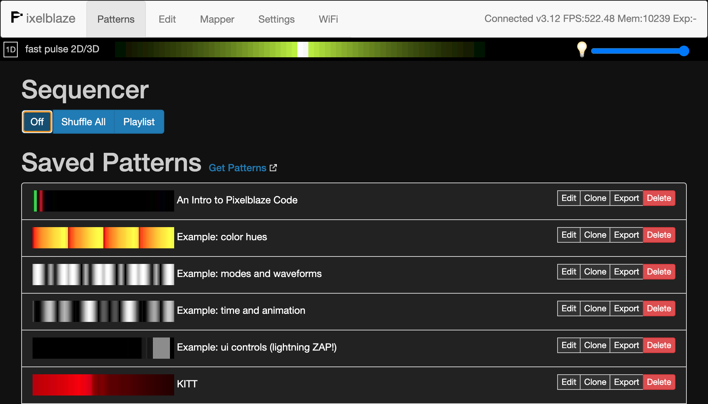
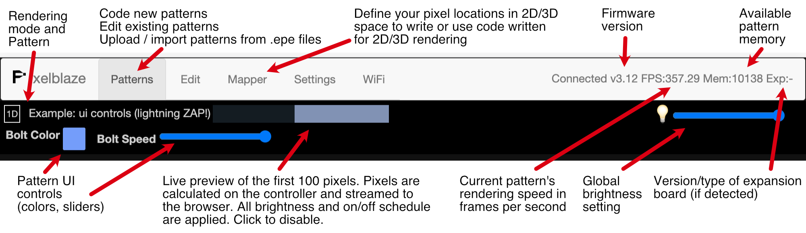
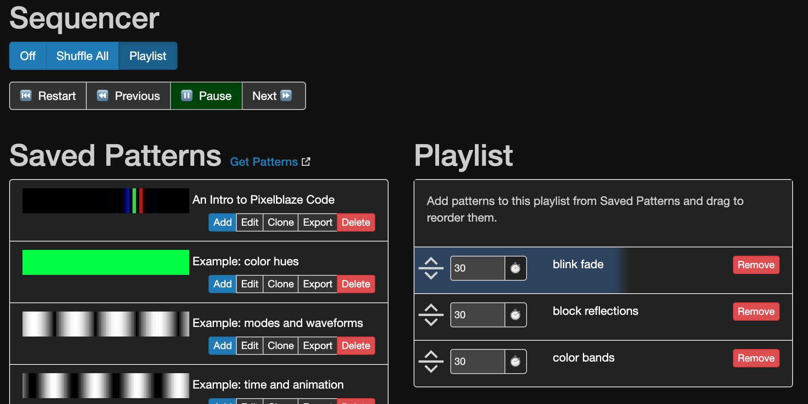

# Pixelblaze App User Interface

<style>
.warning {
  color: red;
}

pre {
	color: inherit;
	background-color: #222;
	padding: 1em;
}

img.full {
	width: 100%;
	max-width: 600px;
}

img.full-big {
	width: 100%;
}
       
</style>

## Accessing the App

Pixelblaze has a built-in web server and web app that has everything you need! Once WiFi is configured, you access it directly with any modern browser.

### Client Mode IP Address Discovery

In Client mode, Pixelblaze connects to your local WiFi network and gets an IP address from your router. If you enable the Discovery Service, you can always find it here:

[http://discover.electromage.com/](http://discover.electromage.com/)

This service will work as long as the device you are using is on the same network.

If you did not enable the cloud discovery feature, you'll need to find this IP address to use it. [These instructions for finding a raspberry pi](https://www.raspberrypi.org/documentation/remote-access/ip-address.md) without a display provide a good outline of ways to find a device on your network. If you use the nmap method e.g.:

```
nmap -sn 192.168.1.0/24
```

### AP (Access Point) Mode

In AP mode, you can always find Pixelblaze at 

[http://192.168.4.1](http://192.168.4.1)

## Using the Web Interface

Once you know the IP address of your controller, you can point a browser to it. You should see a screen that looks like this:




### Navigation and Header

Lets take a closer look at the header. 



There are 5 tabs across the top: Patterns, Edit, Mapper, Settings, and WiFi.


### Patterns

Here you can preview and select any pattern that has been previously saved to the controller. Your controller should have come with a few patterns to get you started.

You can download a pattern file for sharing by clicking **Export**, and remove patterns you no longer want with **Delete**.

Clicking anywhere else on the line will select the pattern for display.

The Edit button will take you to the pattern editor.

#### Sequencer and Playlist



The sequencer can shuffle through all patterns or through a playlist with a specific order and timing.

### Edit

Here you can create new patterns, edit existing patterns, or load pattern files.

A pattern is a tiny software program, typically made up of mathematical expressions to generate pixels.

#### Creating a New Pattern

Click the **New Pattern** button.

A very simple boilerplate pattern is filled in for you. Everything you type is compiled on the fly and sent to the controller. An online reference is provided on the same page, just below the editor.

You may want to jump to [Writing Your First Pattern](https://www.bhencke.com/pixelblazegettingstarted#writing-your-first-pattern)

You can save a pattern by providing a unique name and clicking **Save** once a preview has been generated. After each edit, a preview is generated. This takes a few seconds.

If you are editing an existing pattern, **Save** will become an **Update** button.

### Mapper
The mapper tab allows you specify the position of your LEDs in 2D or 3D space, so you write patterns in terms of x, y, and z instead of the pixel index. Learn more on the [Mapping page](https://www.bhencke.com/mapping-in-pixelblaze).

### Settings
Here you can change settings related to the LED strip.

The Pixels setting controls how many pixels will be generated. Since these are calculated as they are sent out, very large strips can be supported with modest frame rates.

Pick the LED Type corresponding to the type of pixels you’ve connected.

The Data Speed controls how fast data is sent out to the strip. Faster speeds may improve frame rates, but if you experience flickering, try a lower Data Speed.

The Color Order can be used to correct color issues with different versions of LEDs.

### WiFi

Pixelblaze version 3 introduced a WiFi tab to quickly change WiFi settings. 
